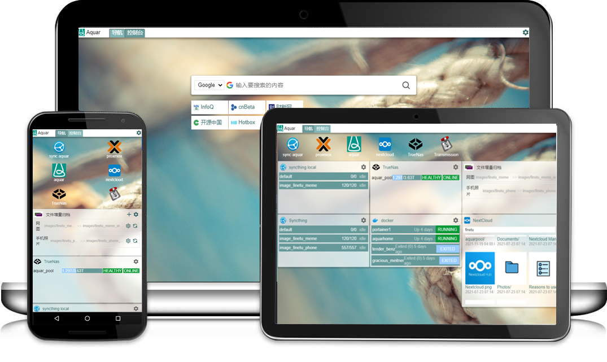

# Aquar Home
### 高度可定制的个人Home页，同时是强大的NAS服务控制台。

AquarHome(水瓶Home页)是一个强大可定制，其本身具备基础导航功能（如搜索框、导航链接）的同时还适配了多种NAS常用服务的API，集成了NextCloud、Docker、Syncthing、TrueNas等服务，可以在同一页面直接看到各个服务的核心数据与最新状态。

本仓库是AquarHome的帮助文档，主要介绍如何正确配置其中的各个组件。

<!-- [系统配置说明](# "系统配置说明") -->

[图标链接配置说明](./app/Icon.md "图标链接配置说明")

[Docker配置说明](./app/Dcoker.md "Docker配置说明")

[NextCloud配置说明](./app/NextCloud.md "NextCloud配置说明")

[TrueNas配置说明](./app/TrueNas.md "TrueNas配置说明")

[Syncthing配置说明](./app/Syncthing.md "Syncthing配置说明")

<!-- [增量备份组件配置说明](# "增量备份组件配置说明") -->