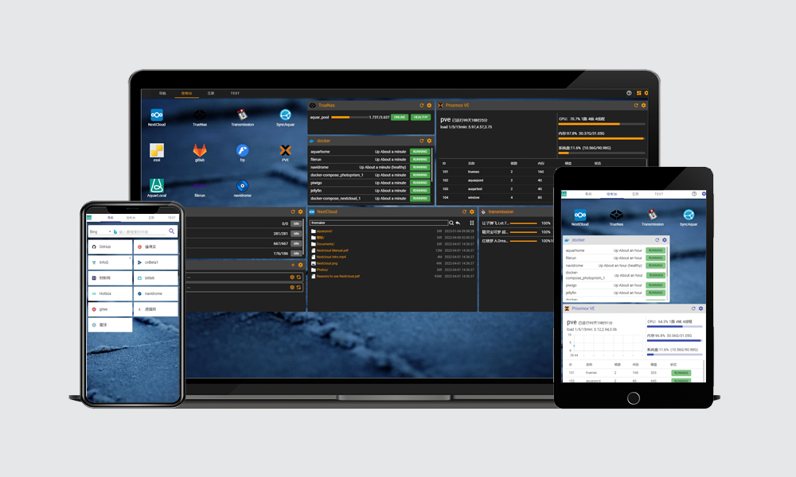

# Aquar Home
### 高度可定制的个人Home页，同时是强大的NAS服务控制台。

AquarHome(水瓶Home页)是一个强大可定制的个人Home页，其本身具备基础导航功能（如搜索框、导航链接）的同时还适配了多种NAS常用服务的API，集成了NextCloud、Docker、Syncthing、TrueNas等服务，可以在同一页面直接看到各个服务的核心数据与最新状态。

AquarHome的核心特性：
- 适配各种开源服务api的组件
  - nextcloud文件浏览器
  - trueNas存储池状态监控
  - docker容器状态监控
  - Syncthing同步目录状态监控
  - PVE虚拟机状态监控
  - 基于rsync的文件增量备份组件
- 完善的Home页导航功能
  - 多尺寸的图标样式
  - 自定义上传图标
  - 自动抓取网站ico图标
  - 链接批量导入
  - 搜索引擎组件
- 实时视频对讲能力
- 页面适配移动端设备显示
- 所有组件大小位置可自定义
- 多标签页
- 同时支持登录信息验证与无登录验证
- 风格主题可选
- 背景图片可自定义

技术特性：
- vue+nodejs技术栈
- docker镜像
- 不依赖数据库
- 全站HTTPS，可更换证书
- 实时流媒体能力

目前项目仍处于早期，更多组件已列入开发计划：
- todoList组件
- 日历组件
- 留言板&相册幻灯片
- rtsp推流监视器
- emby/jellyfin组件
- ...

本仓库是AquarHome的帮助文档，主要介绍如何正确安装系统及配置其中的各个组件。

[系统安装与整体介绍](./app/OverView.md "系统安装与整体介绍")

[图标链接配置说明](./app/Icon.md "图标链接配置说明")

[Docker配置说明](./app/Docker.md "Docker配置说明")

[NextCloud配置说明](./app/NextCloud.md "NextCloud配置说明")

[TrueNas配置说明](./app/TrueNas.md "TrueNas配置说明")

[Syncthing配置说明](./app/Syncthing.md "Syncthing配置说明")

[增量备份组件配置说明](./app/ArchivePhase.md  "增量备份组件配置说明")

[Transmission组件配置说明](./app/Transmission.md  "Transmission组件配置说明")

[视频聊天组件配置说明](./app/ChatRoom.md  "视频聊天组件配置说明")