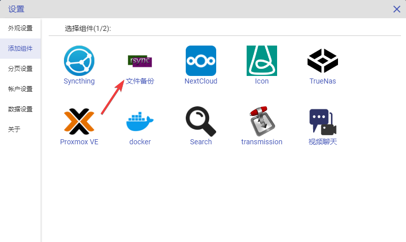
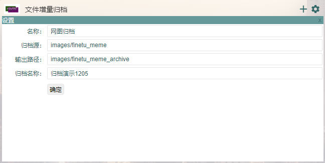
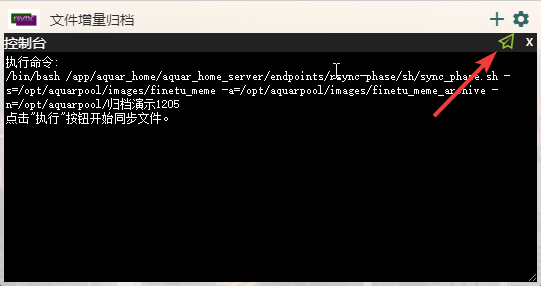
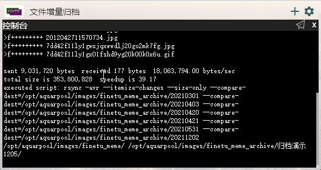
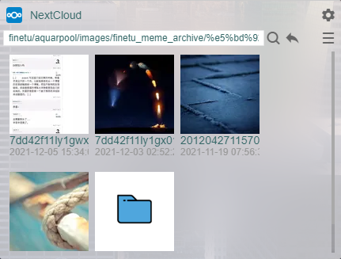

# 增量归档组件配置

增量归档功能是一个不依赖于外部服务的功能，它可以对一个大文件夹进行增量归档。这个功能基于linux最强文件同步程序——rsync，稳定高效，很多市面上的文件同步工具就是基于rsync进行包装实现的。

设想这样一种场景：你隔段时间就会外出游玩(工作)，外出时拍很多照片，但是所有照片都混在一起，当你想要整理归档这些照片时，你需要  
(1) 把这次外出的照片挑选出来。  
(2) 把它们考进一个文件夹中  
(3) 把这个文件夹命名为“XXX外出”  
增量归档这个功能可以帮助你一键完成上面的三步操作，他会自动找出相对上一次归档多出来的文件，把这些文件存放在你指定名称的文件夹中（也可以指定名称，默认按当天日期建立文件夹）需要强调的是：增量归档功能并不影响源文件夹，他只是自动找出归档目录下没有的文件，把这些文件复制到归档目录中特定的文件夹下。

使用方式如下：

1.在AquarHome中点击右上角的齿轮标志进入设置页面，点选左侧“添加组件”菜单，选择“文件增量归档”功能，在参数设置页面不需要设置什么参数，直接点击确定。




2.点击确认后组件在页面上生成，点击左上角的“+”号按钮，添加一个新的同步任务。在表单中填入需要归档的源文件夹，保存归档数据的目标文件夹以及归档文件的名称（若不填写系统会以日期作为每次归档的名称如20211205）。  
这个表单有这几处需要注意：  
(1) “归档源”和“输出路径”都是以AquarHome的外挂数据目录为根目录的，如果你使用docker部署系统，那么这个目录就是容器配置中与容器内`/opt/aquarpool`目录对应的宿主机目录。在设计上，这个目录的本意是希望你指定一个容量足够大且存放着你平时经常维护与访问的数据目录，这个目录可能是nfs共享目录、zfs存储池，或者挂载了一个大硬盘的目录等等。而处于安全上的考虑，“增量归档”这个这个组件的所有操作都限定在这个目录下。所以，例子里的image/finetu_meme目录，实际上是`/数据目录的根/image/finetu_meme`，下面的输出路径也同理。  
(2)“归档名称”指的是下次归档的文件夹名称，按例子中的写法，意思就是：将增量的文件保存在`/数据目录的根/image/finetu_meme_archive/归档演示1205`中。这个表单项可以留空，如果今天是2021年12月5号，那么留空就表示将增量的文件保存在`/数据目录的根/image/finetu_meme_archive/20211205/`目录中。如果你从第一次就指定了归档名称且从不修改，那么这个功能就退化成了普通的文件夹数据同步功能，如果你有这种需求，这样使用也没有任何问题。



3.点击确认后，任务被成功添加到列表中。点击右侧的同步按钮，出现一个命令行视图，并提示
```
执行命令：/bin/bash /app/aquar_home/.../sync_phase.sh -s=/opt/aquarpool/[归档源路径] -a=/opt/aquarpool/[归档输出路径] -n=/opt/aquarpool/[本次归档的文件夹名称]
```
其中sync_phase.sh是AquarHome封装rsync功能的脚本，脚本内容可以在项目的源码中找到。整个语句列出了脚本的各个参数，这些信息平时不需要关心，但如果你发现同步的结果与你的预期不符，这些信息可以作为你排查问题的重要线索。



4.点击右上角的执行（小飞机）按钮，如果你的设置合理，就会看到有一些文件同步信息打印在控制台上。如果你使用过rsync命令的话应该可以认出这就是rsync的输出信息，控制台上除了rsync的输出信息，还会显示真正执行的rsync命令是什么，这平时也是无需关注，但对于排查问题同样非常重要。等待同步过程执行完毕后，本次增量同步就结束了。如图所示就是执行完成后的输出信息，信息全文单独粘贴在下面。



```
执行命令:
/bin/sh /app/aquar_home/endpoints/rsync-phase/sh/sync_phase.sh -s=/opt/aquarpool/images/finetu_meme -a=/opt/aquarpool/images/finetu_meme_archive -n=归档演示1205
点击"执行"按钮开始同步文件。
source_dir    = /opt/aquarpool/images/finetu_meme
archive_dir   = /opt/aquarpool/images/finetu_meme_archive
archive_name  = 归档演示1205
sending incremental file list
created directory /opt/aquarpool/images/finetu_meme_archive/\#345\#275\#222\#346\#241\#243\#346\#274\#224\#347\#244\#2721205
cd..t...... ./
>f+++++++++ 2012042711570689.jpg
>f+++++++++ 2012042711570734.jpg
>f+++++++++ 7dd42f11ly1gwxjqxwwdlj20go2mk7fg.jpg
>f+++++++++ 7dd42f11ly1gx01fshd9yg20k00k0x6u.gif

sent 9,031,720 bytes  received 177 bytes  18,063,794.00 bytes/sec
total size is 353,800,828  speedup is 39.17
executed script: rsync -avr --itemize-changes --size-only --compare-dest=/opt/aquarpool/images/finetu_meme_archive/20210301 --compare-dest=/opt/aquarpool/images/finetu_meme_archive/20210403 --compare-dest=/opt/aquarpool/images/finetu_meme_archive/20210420 --compare-dest=/opt/aquarpool/images/finetu_meme_archive/20210421 --compare-dest=/opt/aquarpool/images/finetu_meme_archive/20210531 --compare-dest=/opt/aquarpool/images/finetu_meme_archive/20211202  /opt/aquarpool/images/finetu_meme/ /opt/aquarpool/images/finetu_meme_archive/归档演示1205/
```
5.我们打开数据目录确认一下，同步的数据是否复合预期。如果你的数据目录同时挂载在nextcloud中，那么使用NextCloud组件，这个任务就可以直接在AquarHome中方便地完成。下图展示了在NextCloud组件中查看目录中图片情况。可以看到文件已经按照预期正确的将上次归档后新增的文件同步到了目标文件夹中。


