# 视频聊天组件配置

视频聊天已经越来越成为现代工作与生活不可缺少的一部分。AquarHome作为一个拥有独立服务端的控制中心，同样需要具备实时音视频能力。“视频聊天”组件相当于zoom或腾讯会议的自托管（self host）实现，添加后提供一个聊天室，在进入房间后，你可以通过打字或者视频的方式与房间内的所有人交流。

由于AquarHome可以部署在公网上，且使用标准的web技术实现所有功能，所以你可以在任何安装有现代浏览器的设备上使用这一功能。这可以衍生出大量有趣的使用方式，祝你玩的愉快。

需要注意的是，该组件采用的WebRTC技术方案需要服务器端明确告知客户端服务器在公网的（或者其他可达的）IP地址（宣告IP）。且需要预留额外的多个端口作为流媒体数据通道，在现实中复杂的网络环境下，特别是NAT环境下，需要确保网络链路上各个环节的联通性。下文将详细阐述。

## 组件添加及宣告IP设置

1.在AquarHome中点击右上角的齿轮标志进入设置页面，点选左侧“添加组件”菜单，选择视频聊天，点击进入参数设置页面，不需要填写任何信息，直接确定。  

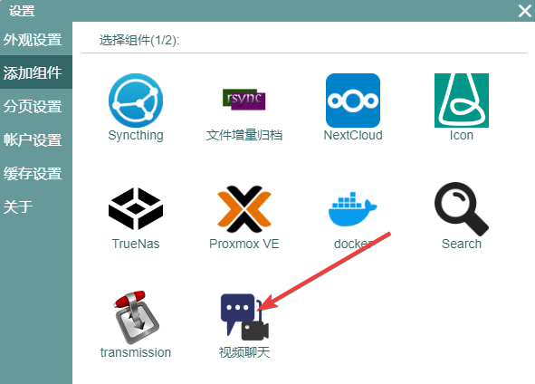

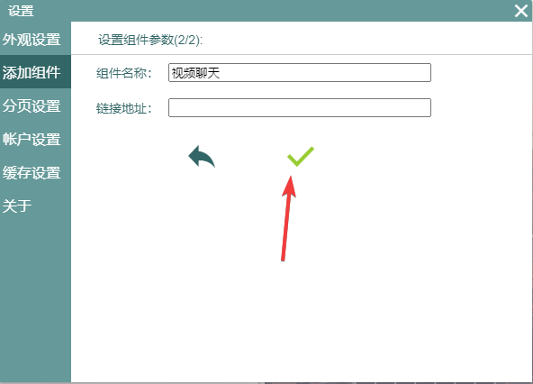

2.点击组件的右上角齿轮标志进入组件的设置页面，在“宣告IP”的表单项中填写你服务器的公网IP地址或者其他内网地址，可以填写多个，每行一个。填写完成后点击确定，然后刷新页面。这个设置可能略显奇怪，原因是webrtc在建立连接时需要服务器方主动声明自己的IP地址，而服务器端并不知道自己在不同网络环境下的IP地址是多少，所以这是就需要人工设置，又因为实际情况中，网络环境可能有很多个，所以你可以填多个地址在这个列表中。下图中即填写了一个公网IP地址以及一个家庭局域网IP地址。

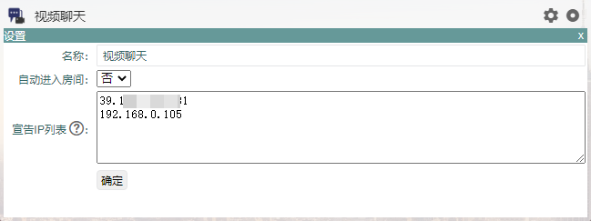

## 功能使用

组件添加并设置宣告IP以后，就可以点击右上角的圆形图标或者右下角的“加入房间”链接进入房间。

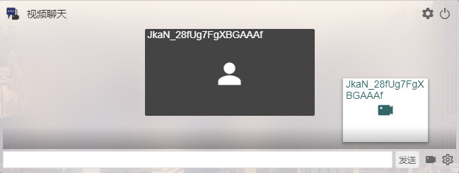

进入房间后可以看到房间中的其他终端设备，如果有另外的设备发送了文字消息，那么你可以接收到这些消息。

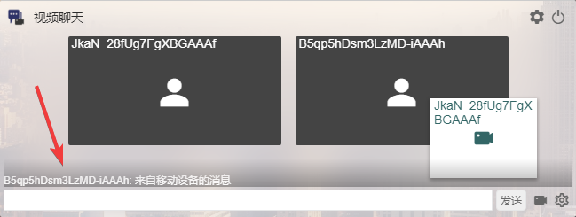

点击下方的文字输入框，可以展开文字消息框，看到更多消息并向其他人发送文字消息。

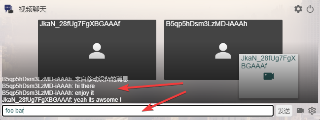

点击摄像头图标，打开本地设备的摄像头开始视频聊天。

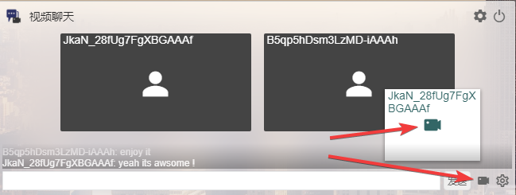

视频开通后在另一个设备上就可以看到相应的视频了。

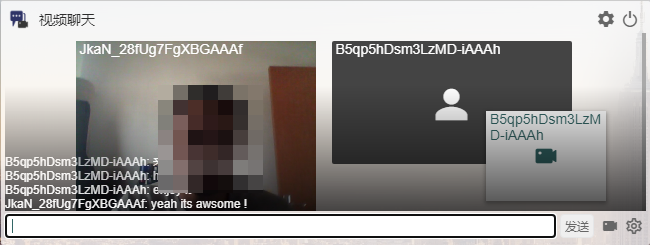

点击右下方的设置按钮，可以设置该设备的昵称以及切换视频音频源。

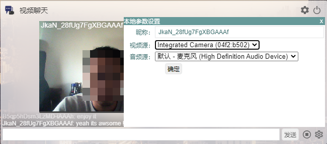

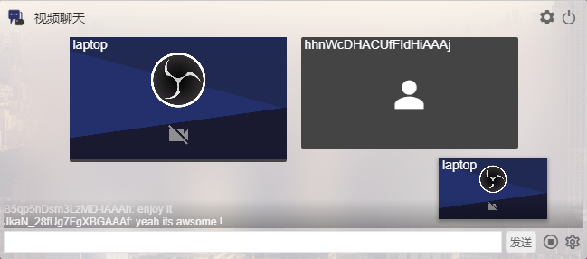

## NAT环境下的部署配置

现实的网络环境中最常见的是内网环境，我们采用NAT内网穿透（本例中使用frp作为穿透工具）技术来使我们在内网中的服务可以暴露自己的某些网络接口在公网环境中，那么我们需要在公网防火墙和NAT转换配置处检查端口是否畅通。但这还没完，我们的主机可能是一台虚拟机，且AquarHome通常部署在Docker容器中，于是我们还要确认宿主机没有做特别的网络限制，且docker容器配置了相应的端口映射。整条网络链路很长，下面举例说明如何疏通整个NAT链路。

举一个例子：假设我们自建frp NAT服务，且AquarHome服务部署在家中的NAS中，你需要根据自己的网络情况，按照上面的思路逐点排查网络端口配置情况。这很重要，因为在需要预留100个端口的情况下，未经过认真配置的网络大概率是不通的，且网络问题不会反映在系统日志或者任何友好的系统提示上。

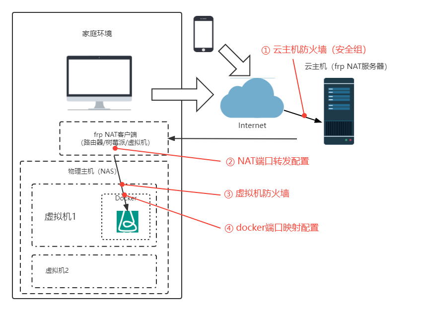

在自建NAT环境中检查一下事项：  
1.查看云主机安全组的入站策略，确保开通了tcp协议的8172端口及10000-10100端口，查看云主机linux防火墙（iptable/firewall)是否开启，若开启则添加8172端口及10000-10100端口白名单，或直接关闭防火墙。  
2.在NAT客户端（frpc配置文件）配置中查看针对远端8172端口及10000-10100端口的转发是否指向了虚拟机1的内网IP的对应端口。  
3.确保虚拟机1的防火墙有8172端口及10000-10100端口的白名单或者是关闭状态。  
4.核对docker run命令或者docker-compose.yml相应配置中是否同时映射了8172端口及10000-10100端口到宿主机的相同端口上。

这里还有一个更加专业的技巧，你可以先将视频聊天组件打开，进入房间，然后打开摄像头，这时服务器会指定一个10000~10100的tcp端口开始监听，这时候在虚拟机1上使用`lsof -i -P -n | grep LISTEN`命令查看究竟是哪个端口在被监听，例如是10001，那么你可以从虚拟机1开始，使用`telnet ip地址 10001`命令逐个节点得验证端口的联通性，如果telnet成功就说明网络顺畅，否则你就需要检查这段网络究竟是哪里没有设置好。