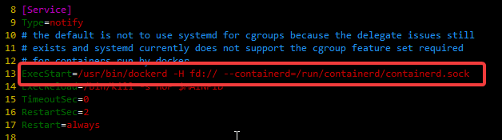
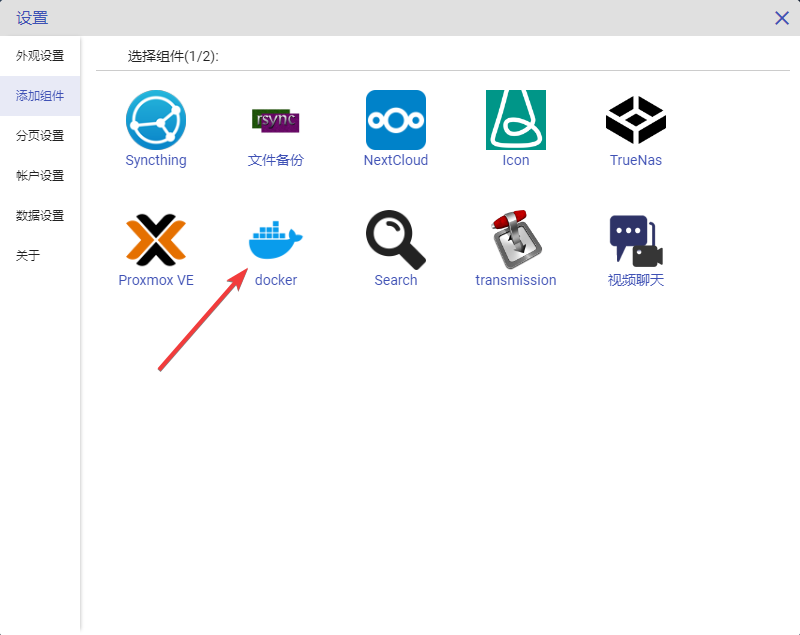
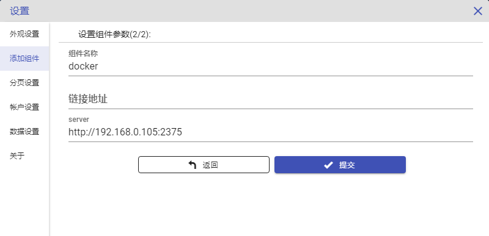
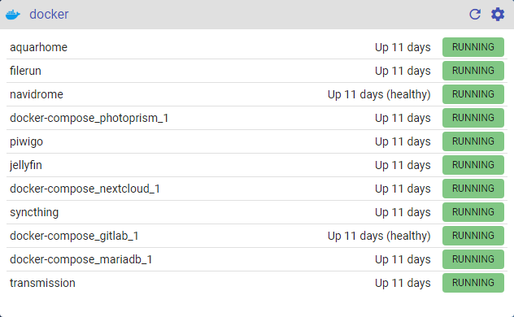

# Docker配置

Docker是DIY NAS中不可缺少的容器服务，经过长时间的发展，已经有大量优秀的软件首选docker进行分发，AquarHome也将Docker部署方式作为推荐方式，这省去了使用者大量的运维成本与学习时间。通常一套系统会有多个docker容器同时运行并互相配合，所以监测这些docker容器的运行状态就成为一件重要的事情，下面来介绍如何在AquarHome中配置docker监控组件。本文档针对的是通用linux环境下的docker服务配置，在专有环境下如：黑/白群晖、微联通等可参考文档中的配置采取等价的操作。

配置方式如下：

1.确认docker是否开启了rest api服务。以管理员身份(sudo)打开docker的systemd服务注册文件，不同的系统位置略有不同，ubuntu 20的路径如下：
sudo vim /lib/systemd/system/docker.service



查看13行左右的execStart，是否有类似“-H tcp://0.0.0.0:2375”的参数，如果没有则加上，加上后，该行配置为下面所示：
```
ExecStart=/usr/bin/dockerd -H fd:// -H tcp://0.0.0.0:2375 --containerd=/run/containerd/containerd.sock
```

2.执行`sudo systemctl daemon-reload`更新服务配置

3.手动停止所有docker上运行的容器，然后执行`sudo systemctl restart docker.service`重启docker服务,此时docker的rest api就已经开启了。

*注意：docker的rest api服务默认并没有权限验证的能力，所以不要把它暴露在公网环境上。

1.点击AquarHome右上角的齿轮标志进入设置页面，点选左侧“添加组件”菜单，选择Docker，点击进入参数设置页面。



2.将docker宿主机的内网ip填入server表单项中，例如我的docker宿主机地址为192.168.0.117，配置如下图所示



3.点击确定后可以看到，组件已经拉取到了docker容器运行的信息。


