# 链接图标配置

作为一个个人Home页，AquarHome最基本的功能就是添加链接图标。链接图标有两种形态——图标形态和条状形态。转换逻辑是：当图标组件的高度为1格时，其显示为条状形态；当图标组件高度大于1格时，其显示为图标形态。此外AquarHome还支持图标的批量导入。

## 单图标配置方式：

1.点击AquarHome右上角的齿轮标志进入设置页面，点选左侧“添加组件”菜单，选择Icon，点击进入参数设置页面。

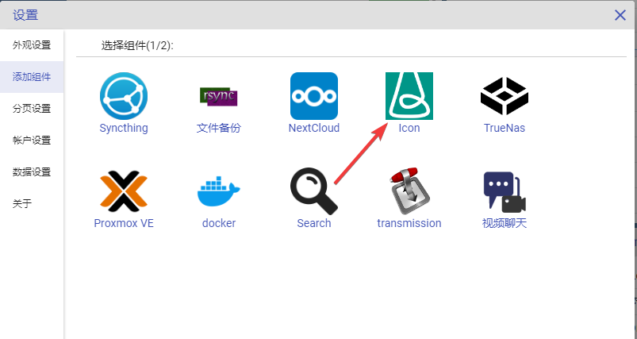

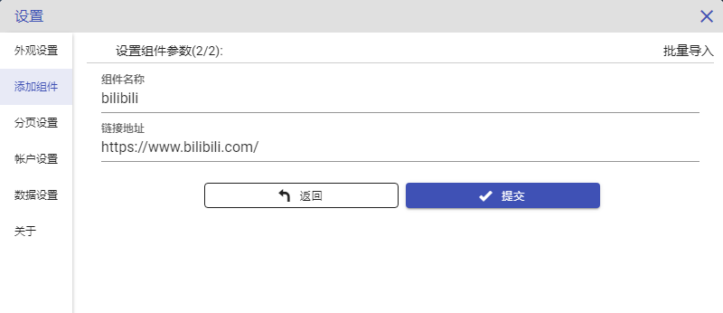

2.在页面中填写图标名称与链接地址，点按确定，即可看到桌面上生成了一个新图标，并且自动抓取到了网站的ico。

3.点击图标右上方的设置按钮，可以进行更多参数的设置。

4.点击设置后可以看到，设置页面如下图所示。

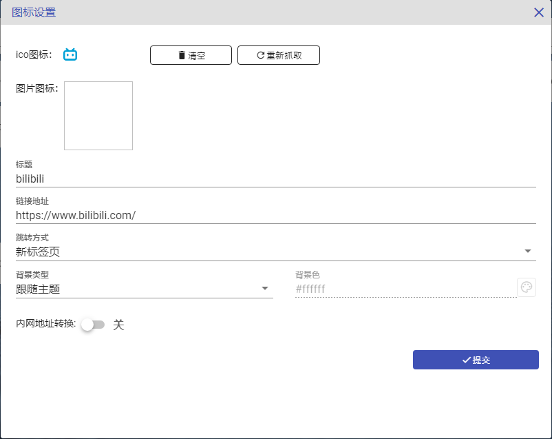

4.1自动抓取的ico图标可以清空或者重新获取。

4.2点击图标图片，可以上传本地图片作为图标图片使用。

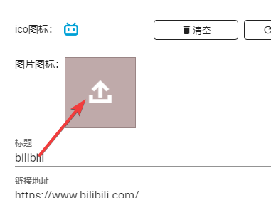

选择本地图片后，可以在页面上进行调整，调整完成后点击下方的确定按钮，即可完成上传。

5.点击设置页面的提交按钮后，新的配置即生效。

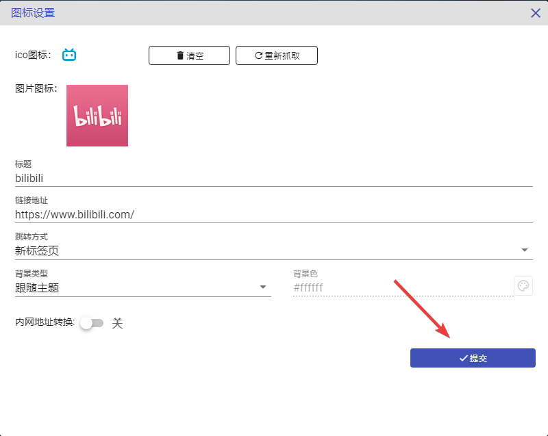

6.点击页面右上方的设置布局按钮后，再拉组件动右下角，可以看到图标组件可以根据需要尺寸适配不同的形态。

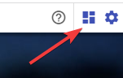

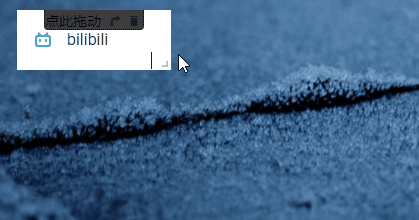

7.当清空ico图标后，手动上传的图标会替代原来的ico图标，作为条状形态的图标使用。重新获取ico图标后，条状图标又切换会ico图标。

8.在设置页可以根据个人需要设置不同的跳转方式。
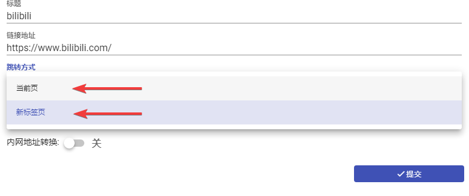

9.在设置页可以根据需要设置不同的背景色
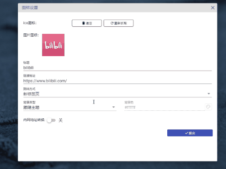

10.设置页面中可以设置链接的内网地址，当设置改选项后，如果从一个内网地址访问AquarHome，那么点击这个链接会访问这个内网地址，其他情况仍然访问默认地址。
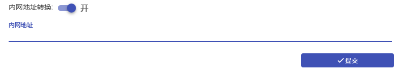

## 批量导入链接

AquarHome支持以文本方式批量导入图标，以避免重复操作。

配置方式如下：

1.点击AquarHome右上角的齿轮标志进入设置页面，点选左侧“添加组件”菜单，选择Icon，点击进入参数设置页面。

2.在参数页面的右上角点击“批量导入”按钮，进入批量导入页面。

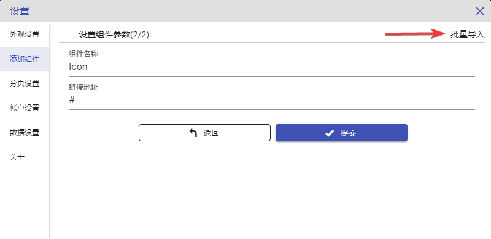

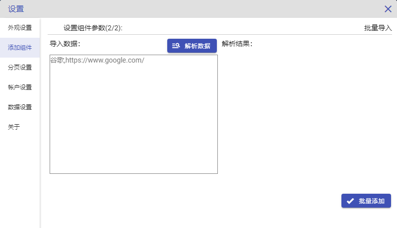

3.在左侧按照[链接名],[链接地址]的格式写入要导入的数据，点击上方的"解析数据"按钮，即可看到右侧解析出了数据并翻译成了markdown的格式。

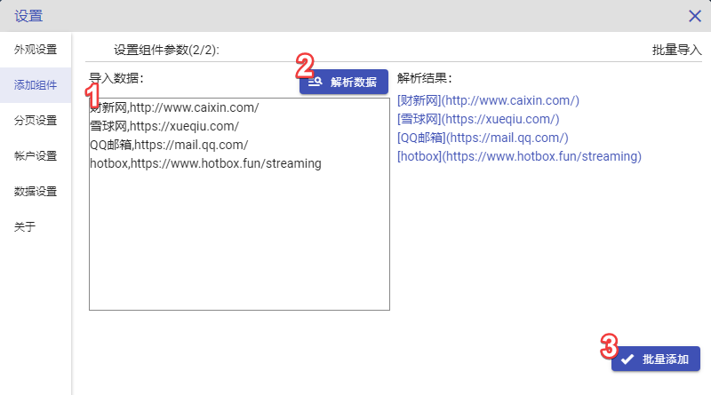

4.点击“批量添加”按钮，等待一段时间。关闭设置页面后即可看到页面上出现了批量生成的图标组件。

5.若有一些图标未正确抓取到ico图标，则打开其设置页面尝试重新抓取即可。国外的网站可能抓取不成功。你懂的。
