# NextCloud配置

NextCloud几乎是最著名的个人云服务软件，有完善的文件管理功能，涵盖普通文件管理，照片管理和简单的视频观看功能，支持外部目录的管理使得它可以与其他系统非常顺畅的配合使用。本文档内容聚焦于如何在AquarHome中配置有的服务，所以本文假定你已经有了一个正常运行的NextCloud服务。

配置方式如下：

1.点击AquarHome右上角的齿轮标志进入设置页面，点选左侧“添加组件”菜单，选择NextCloud，点击进入参数设置页面。

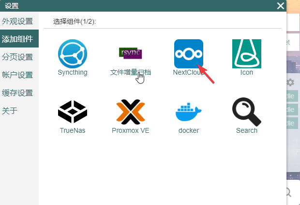

2.打开NextCloud的web端页面，默认接口为80,请根据你自己的配置进入正确的端口号。将服务地址记下，填入组件设置的“链接地址”中，如果你有公网地址，可以把公网地址填进去。

3.AquarHome是一个拥有服务器端的应用，所有组件的数据拉取操作都是由服务端完成的，所以配置服务的地址也是以服务部署所在的服务器的网络环境为基础的。

所以如果你的AquarHome装在你家的服务器上，而你在自己的笔记本上有一个NextCloud实例，那么你在组件设置时在Server一栏应该填入的是你笔记本电脑在家庭内网的地址而非localhost。而如果你想连接运行在同一台服务器上的NextCloud，那就需要在配置时填写内网地址。本例中我填入的是家庭局域网中nextcloud的地址：http://192.168.0.117。由于nextcloud的授权流程必需在客户端浏览器上打开授权页面操作，所以在server栏中不能使用docker虚拟内网的地址或是host名。

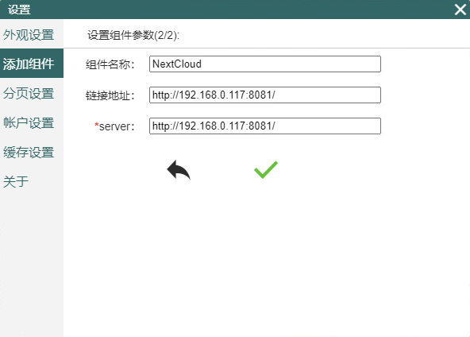

另外需要注意的是，nextcloud处于安全考虑，带有域名限制功能，即他只允许用户以白名单内的域名进行访问，白名单配置在[nextcloud主目录]/config/config.php中,配置方式见下图。

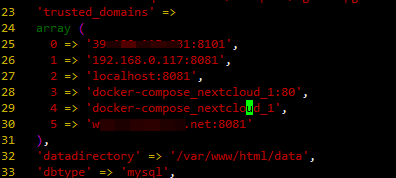

3.点击对勾符号并关掉对话框，可以看到在桌面的最下方有了一个新的nextcloud组件，此时还未获得nextcloud授权。

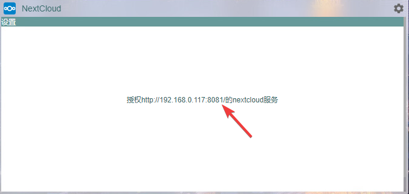

4.点击组件上的链接,可以看到一个动态生成的授权链接。

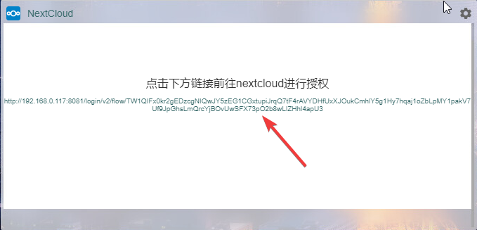

5.点击这个授权链接，浏览器会打开一个新窗口，这个窗口提示你进行授权并警告风险

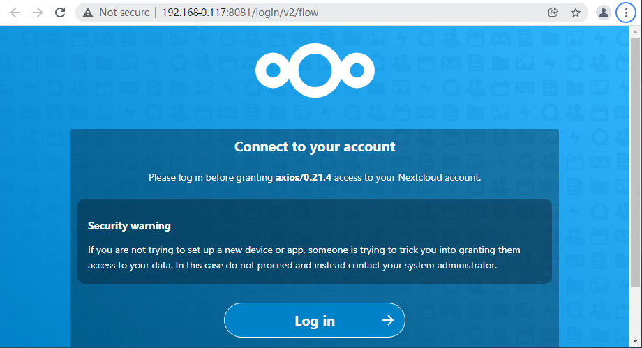

6.点击授权页面的登录（log in）按钮并输入你的用户名密码，如果浏览器上已经拥有你的信息，这一步会跳过。登录成功后，可以看到授权页面。

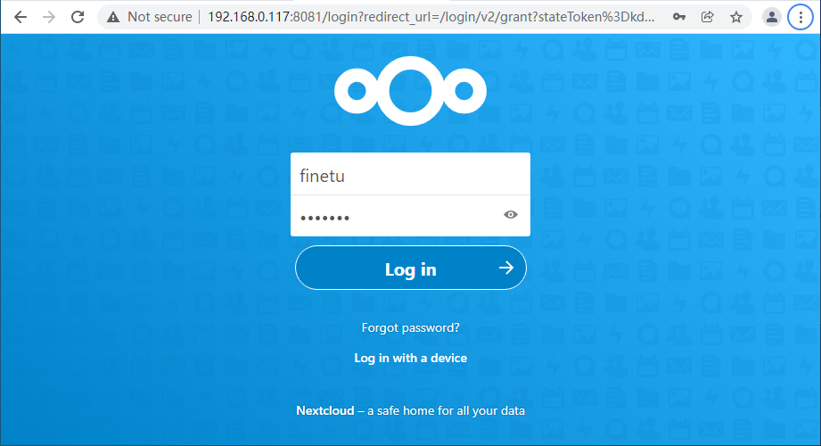

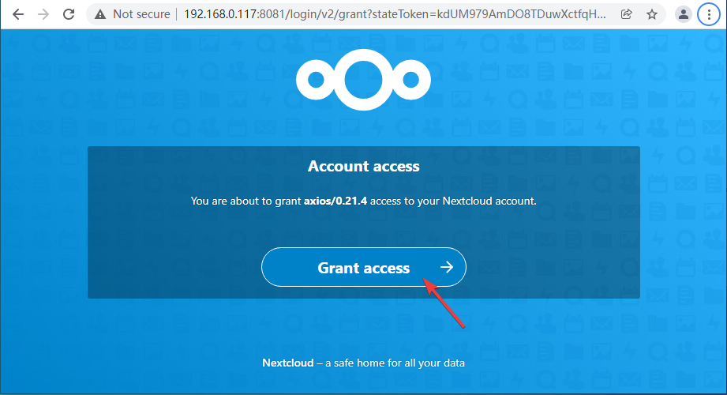

7.点击授权（Grant Access)，可以看到授权成功的页面。

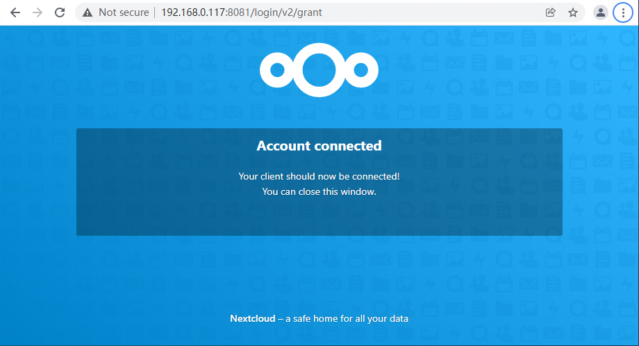

8.回到AquarHome，在组件上可以看到在询问你是否授权成功，在授权时如果停留时间过长会出现超时的情况，如果出现了这种情况，可以点击“重新授权”再走一遍授权流程。如果已经授权成功，则点击“授权成功”按钮。

9.点击后“授权成功”后就可以看到组件正常地拉取到了nextcloud中的目录信息了。

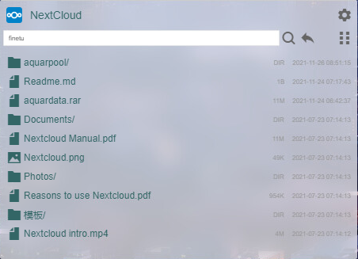

10.右上角的视图切换按钮可以在文件列表模式和缩略图模式间切换，方便浏览图片类文件。

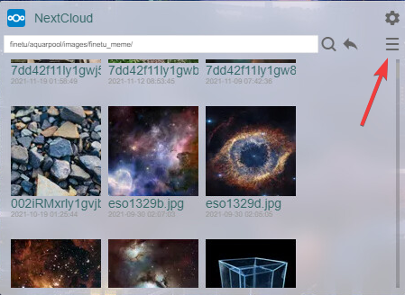

11.点击组件右上角的设置按钮可以看到组件的配置信息，红框所示的信息是根据授权时提供的信息自动生成的，其中默认地址是组件初始化时所在的目录，你可以根据需求自己设置。

