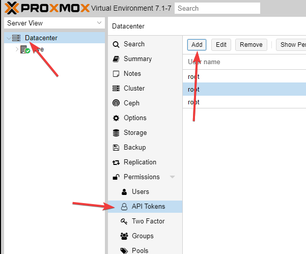
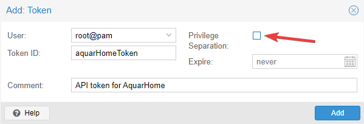
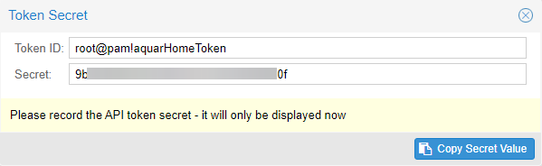
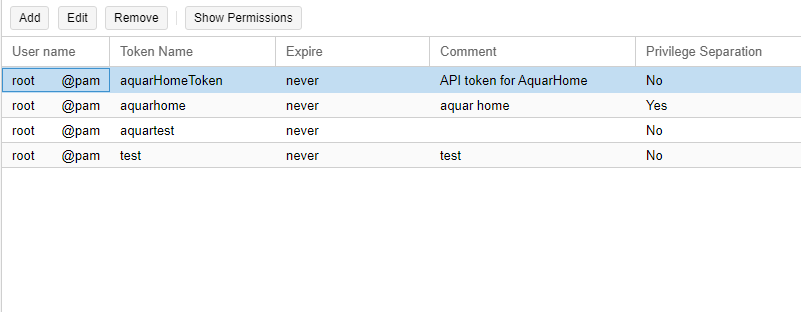
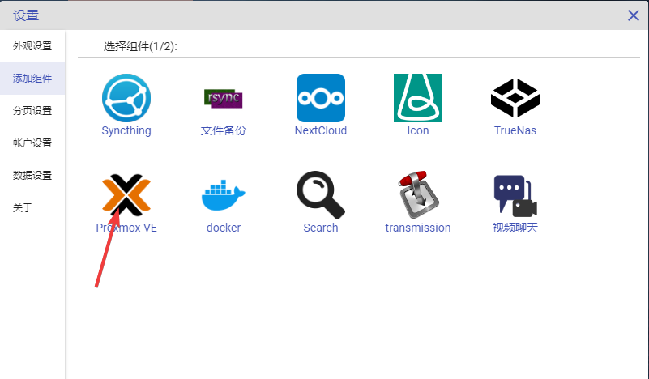
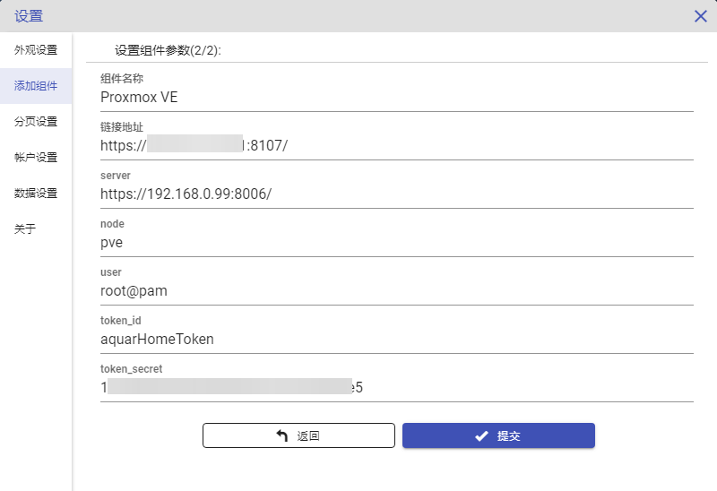
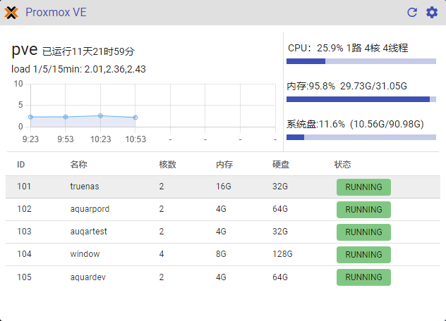

# PVE(Proxmox VE)组件配置

PVE是一套强大的基于KVM的开源虚拟化管理系统，可以在上面创建并管理各种虚拟机，其提供的硬件虚拟化及直通功能是整个Aquar系统稳定高效运行并极具扩展性的基石。由于PVE直接安装在物理宿主机上，所以其管理的硬件信息是其他组件无法提供的，而硬件信息对于日常运维工作也极其重要。

其配置方式如下：

1.进入pve的web管理界面，在Datacenter-> Permissions -> API Tokens 页面中点击左上的Add按钮，添加一个新的API Token。

2.点击Add后可以看到一个表单，User是下拉选择的，选择你的用户，Token ID是这个Token的名字，起一个不带空格的名字，Comment用来描述这个Token的用途，如图所示简单记录。右侧的Privilege Separation指是否将改Token的权限与改帐号分开处理，默认是勾选的，我此处为了方便将其去掉了，你可以根据自己的安全需求自行配置。Expire为过期时间，由于AquarHome]需要长期使用Token，所以不设置过期时间。

3.点击确认后得到TokenID的全名以及一个Secret。
***注意**：Secret的内容仅会在此处显示这一次，当你关掉这个对话框后这个Secret就再也无法从pve中找到了，所以请务必将其复制下来备用。

4.复制Secret后，关闭对话框可以看到Token列表中有一个新的Token已经生成。

5.在AquarHome中点击右上角的齿轮标志进入设置页面，点选左侧“添加组件”菜单，选择PVE组件，点击进入参数设置页面。

6.在配置页面上的链接地址、server、node、user、token_id、token_secret项中分别填入相应的内容，具体填写内容如下图。

7.点击确认后组件在页面上生成，可以看到存储池信息已经被正确获取。

