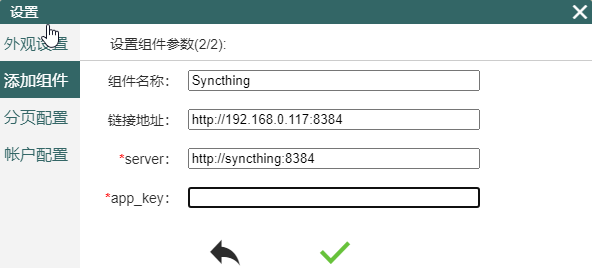
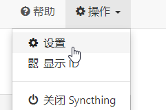
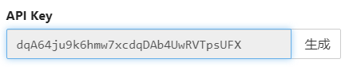
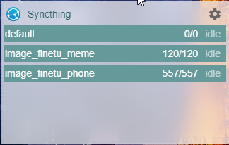

# Syncthing配置

Syncthing是点对点的文件同步服务，支持非ios的其他所有设备。本文档内容聚焦于如何在AquarHome中配置有的服务，所以本文假定你已经有了一个正常运行的Syncthing服务。

配置方式如下：

1.点击AquarHome右上角的齿轮标志进入设置页面，点选左侧“添加组件”菜单，选择Syncthing，点击进入参数设置页面。

2.打开Syncthing的web端页面，默认接口为8384。将服务地址记下，填入组件设置的“链接地址”中，如果你有公网地址，可以把公网地址填进去。

3.AquarHome是一个拥有服务器端的应用，所有组件的数据拉取操作都是由服务端完成的，所以配置服务的地址也是以服务部署所在的服务器的网络环境为基础的。

所以如果你的AquarHome装在你家的服务器上，而你在自己的笔记本上有一个Syncthing实例，那么你在组件设置时在Server一栏应该填入的是你笔记本电脑在家庭内网的地址而非localhost。而如果你想连接运行在同一台服务器上的Syncthing，那需要在配置时填写内网地址或者host名（docker会自动分配为与容器名相同）。

根据上述的叙述，选择正确的地址，填入设置表单的“Server”栏中。下图中链接地址栏中填的是服务器的内网地址，这个地址可以在家里的其他机器访问到。而Server栏中填的是docker compose network自动分配的虚拟内网的host名称，这个名称在docker容器内部等价于docker network 的虚拟内网地址，在我的例子中就是172.18.0.2，这个内网地址可以通过docker network命令查询出来，当然也可以填写主机在家庭局域网中的ip地址，即上图中的http://192.168.0.117:8384。

3.回到Syncthing页面，点击右上方的“操作”按钮，在下拉菜单中点击“设置”，在设置页面的右侧会看到一栏叫API Key，将这个key值复制下来，粘贴到组件配置表单的app_key输入框中。

4.点击确定，刷新页面即可看到组件成功拉取到了数据。

