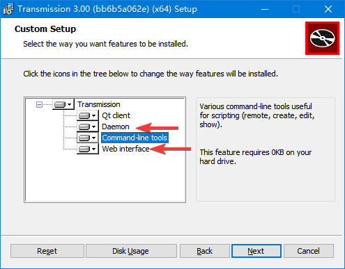
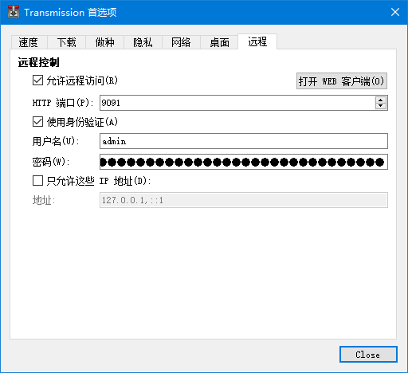
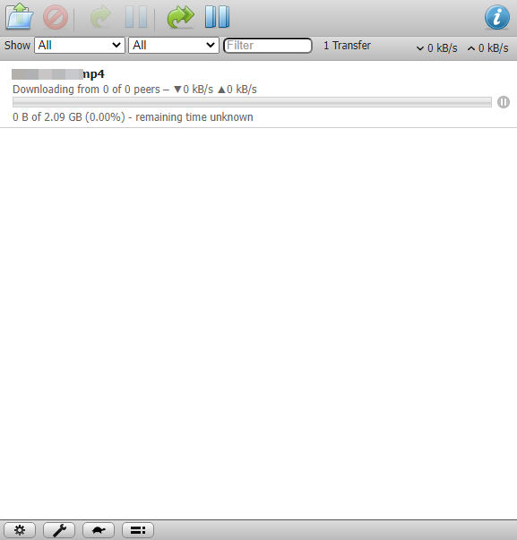
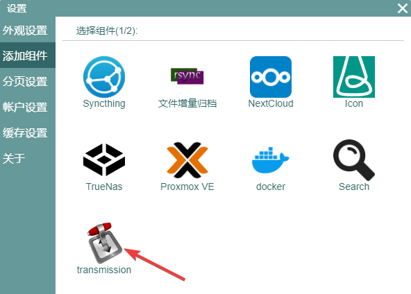
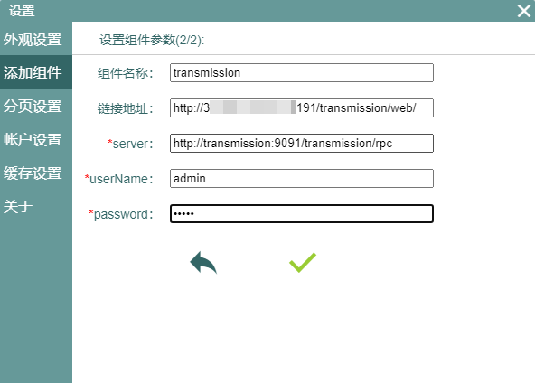
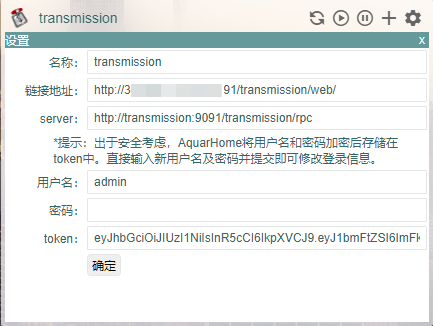
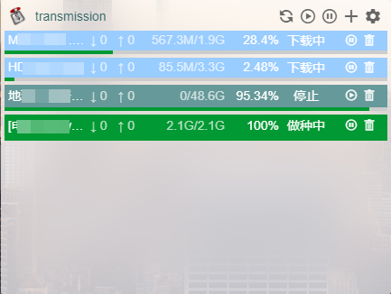
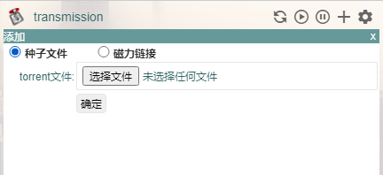
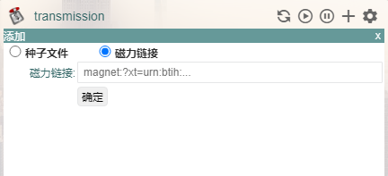

# Transmission配置

Transmission是老牌BT下载工具，同时支持torrent和magnet，并且自带远程管理功能，对于DIY NAS场景非常适用。由于一些bt客户端可以篡改做种策略，所以如今的很多PT下载站对于bt下载工具会有限制，而Transmission,一直都是首选推荐工具之一。

配置方式如下：
0.确认transmission是否有守护进程以及web服务功能。transmission在不同安装方式下的默认安装策略可能有所不同，例如在Windows下安装时，默认不安装守护进程以及web服务功能，导致你即使打开了transmission的远程端口，也无法正常访问。如果你发现你的Transmission属于此种情况，可以打开Transmission的安装文件，点击change，然后安装内容列表中勾选Daemon以及Web Interface两个功能，确定后就可以安装这两个功能了。

1.在transmission中开启远程服务。如下图所示，设置好自己的用户名密码，下面的ip地址限制选项可以取消掉，或者设置成家庭网络中AquarHome的ip地址，设置好以后点击右上的“打开WEB客户端”按钮，如果看到界面正常显示，就说明服务已经正常启动：

2.在AquarHome中点击右上角的齿轮标志进入设置页面，点选左侧“添加组件”菜单，选择Transmission，点击进入参数设置页面。  
**链接地址**是你点击组件标题时跳转的地址，填入公网地址（如果有的话，这样你就可以在公共环境中跳转到transmission的web端）或者家庭网络中的IP地址（这样你只能在家里正确地跳转到transmission的web端）。  
**server**是AquarHome调用transmission远程控制接口的接口地址，这个地址与web端地址在同一个接口上，所以我可以输入`http://与链接地址相同的ip:及端口号/transmission/rpc`来连接服务器，但是由于AquarHome与Transmission服务在同一个局域网内（具体到我的例子中，是在同一个docker虚拟网络内），没有必要让请求进入公网中，所以我可以直接填写transmission服务的host名称及其暴露在内网中的端口来完成这个配置。你需要根据自己的情况来填写正确的地址。  
**用户名及密码**是第1步中设置的用户名及密码信息。由于Transmission的安全机制较弱，所以出于安全考虑，AquarHome将用户名和密码加密后存储在token中，在组件的设置页面你会看到这个token的信息。

3.填写好信息后点击确认，就可以看到组件在页面上生成，如果配置信息正确，就已经可以看到transmission中的任务了。你可以在组件中启停、删除任务，也可以用torrent或者magnet添加新任务，这些操作比较符合直觉，本篇说明中就不在赘述了。

