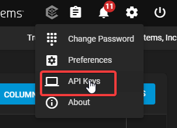
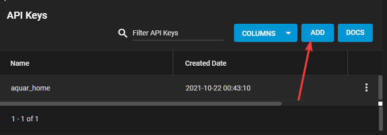
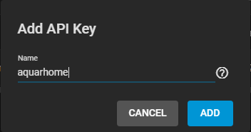
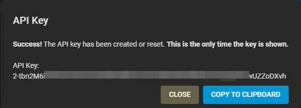
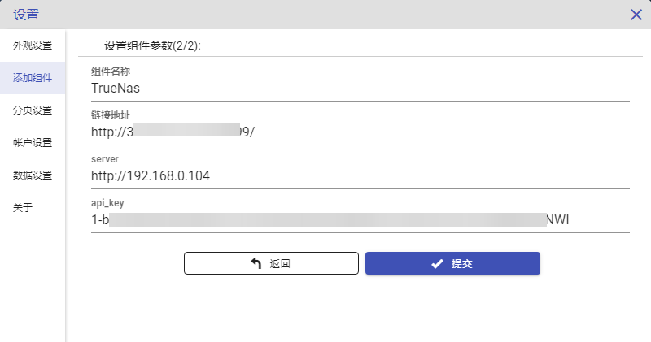
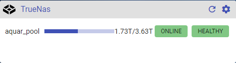

# TrueNas配置

TrueNas core是优秀的开源Nas系统，专注于硬盘管理以及各种基础文件服务的维护，基于FreeBSD，原生支持ZFS。TrueNas无论从技术架构还是产品设计上都是以企业级应用为目标的，整个系统强大且稳定，是整个Aquar系统中最稳定的一环。由于TrueNas处于一个底层服务的位置，很少需要关注它的系统状态，所以目前AquarHome的TrueNas组件只集成了ZFS存储池相关的信息，虽然信息较少，但存储池有任何异常，都会有可能引发数据的丢失存,，所以储池信息可以说是DIY NAS最核心的状态信息。

Aquar目前接入的TrueNas为TrueNas core版本，其他版本未做过测试。

配置方式如下：

1.进入TrueNas，生成一个新的api_key。登录进TrueNas，点击右上角设置，下拉菜单中选择 API Keys。

2.点击API Keys选项后可以看到一个列表，点击列表右上方的ADD按钮，添加一个新的API Key。

3.在弹框中输入这个API Key的名字。

4.输入名字点击ADD后，弹出一个弹框，告知你新生成的API Key的内容，将其复制保存下来。

***注意**：API Key生成后只有这一次机会在TrueNas中显示，当关闭这个弹框后你就再也无法见到这个Key的内容了，如果你没有复制下这个Key可以选择重新添加一个或者，将原来这个重置。

5.在AquarHome中点击右上角的齿轮标志进入设置页面，点选左侧“添加组件”菜单，选择TrueNas，点击进入参数设置页面。

6.在配置页面上的链接地址、server、api_key项中分别填写TrueNas的公网地址（如果有的话，没有就填内网地址），内网地址，以及刚才保存下来的API Key.

7.点击确认后组件在页面上生成，可以看到存储池信息已经被正确获取。

